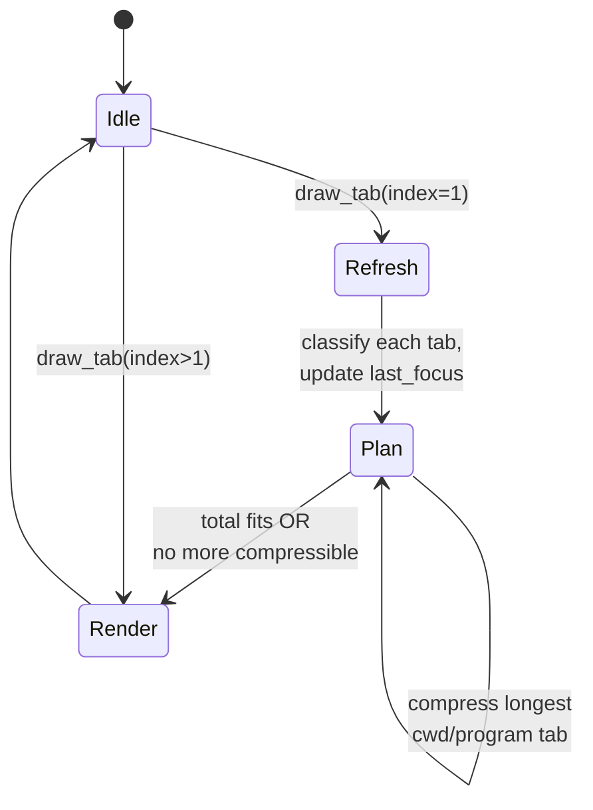
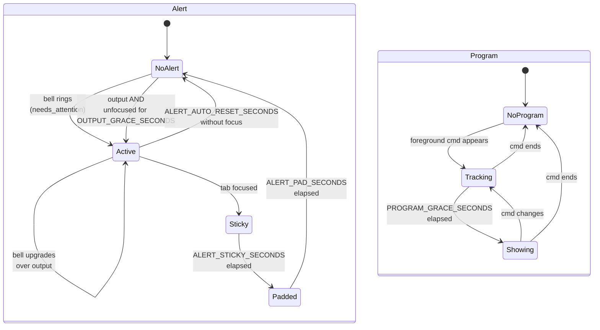
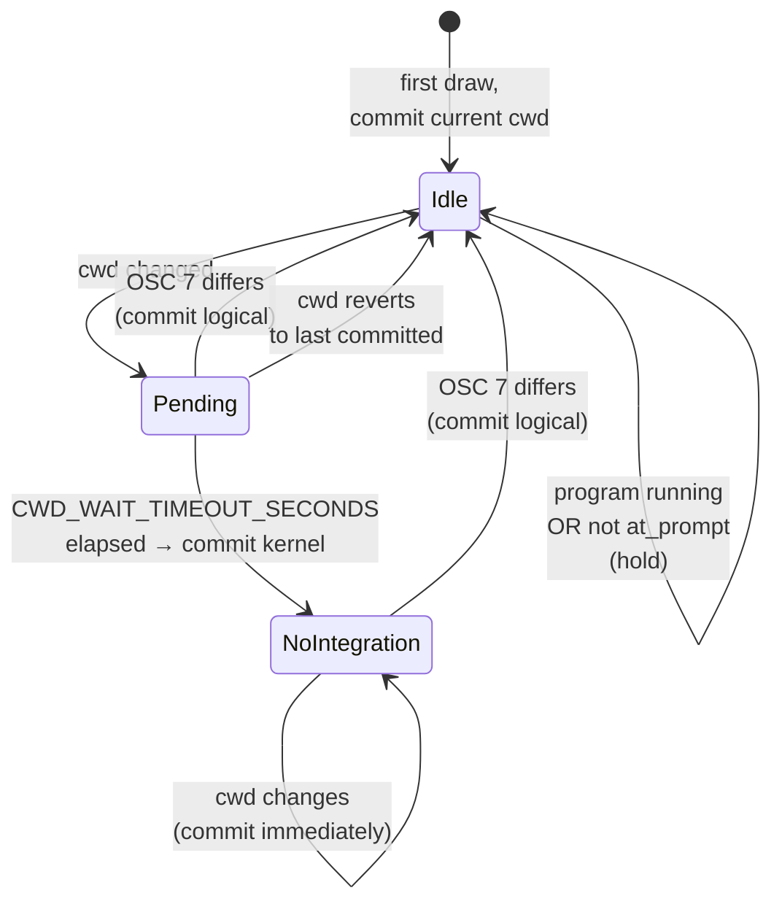

# Tab bar

A custom kitty `tab_bar_style custom` implementation across:

- `tab_bar.py` — kitty interaction, drawing, colors, alert state machine
- `tab_plan.py` — pure planning of which titles fit and which to compress
- `state.py` — per-tab state held across draws
- `tab_bar_config.py` — user-editable settings (colors, timeouts, prefixes)
- `tab_bar_config_parser.py` — validation, defaults, error collection; tab_bar imports values from here as `cfg`
- `watchers.py` — kitty event hooks (registered via `watcher watchers.py` in kitty.conf); marks the tab bar dirty on shell-integration command boundaries (`on_cmd_startstop`)

Settings related to kitty's own tab-bar layout (e.g. `tab_activity_symbol`, `bell_on_tab`) live in `tab.conf` and are tuned to keep our titles from being implicitly extended by kitty (see "Width consistency" below).

## Tabs (bar-level cycle)

- `Refresh` runs once per redraw (on tab index 1), classifying every tab and updating focus timestamps.
- `Plan` is the loop in `tab_plan.rebuild`: while the bar overflows, compress the longest `cwd` or `program` tab.
- `Render` (per tab) draws the planned title with any active alert prefix/color and per-channel equal-color tinting.

## Tab (per-tab state)

Two independent state machines run per tab: **Alert** (bell / output activity, plus the post-focus transition) and **Program detection** (throttled switch from `cwd` kind to `program` kind). A separate **CWD resolution** routine runs every draw to decide what cwd to display.

Subshells (`bash`, `sh`, `zsh`, …) go through the same Program path as any other foreground command — so after `PROGRAM_GRACE_SECONDS` the tab title becomes e.g. `sh`. They are not specially detected.

### Alert visuals per phase

| Phase   | Color    | Prefix              | Width       |
| ------- | -------- | ------------------- | ----------- |
| Active  | alert bg | `🔔` or `💬`        | with prefix |
| Sticky  | alert bg | `🔔` or `💬`        | with prefix |
| Padded  | normal   | spaces (same width) | with prefix |
| NoAlert | normal   | none                | natural     |

The prefix gets a leading space so the bell/bubble glyph is centred relative to the body. Width stays constant across `Active → Sticky → Padded`; the tab only shrinks when the alert clears.

### Program kind selection

Independent of the alert state, each tab's kind is chosen as:

1. `tab.name` set → **user**
2. Foreground program tracked AND past `PROGRAM_GRACE_SECONDS` → **program**
3. Otherwise, last known logical cwd → **cwd**
4. Else → **title** (kitty's effective title)

The grace prevents short-lived commands (`ls`, `git status`) from flickering the tab kind.

## CWD resolution

`_resolve_cwd` runs every draw to update `info.last_cwd`. It reconciles two sources kitty provides:

- `window.cwd_for_serialization` — shell-reported (OSC 7) when the shell is at its prompt, otherwise the kernel's `/proc/<pid>/cwd`.
- `window.cwd_of_child` — kernel cwd directly.

When they disagree, OSC 7 has fired with a different value (the *logical* path); we trust that.

Practical effects:

- Logical paths (matching `$HOME`-rooted form) are preferred; the brief `/shared/...` physical-path flicker through symlinks during a `cd` is masked by the pending+timeout window.
- Compound shell commands (`sleep && printf`) don't update cwd mid-flight; the gate "shell integration works AND not at_prompt" holds the displayed cwd until the next prompt.
- Subshells without integration (`sh`, plain `bash`) eventually hit the timeout once and switch into "no integration" mode for that tab — subsequent kernel cwd updates apply directly.

## Width consistency

Kitty's tab-bar layout sizes each tab from kitty's own templated title, which can implicitly include `{activity_symbol}` or `{bell_symbol}` when the corresponding option is non-empty — even if the template doesn't reference them. That made tabs widen by 1 cell when activity arrived and snap back on focus.

Mitigations in `tab.conf`:

- `tab_activity_symbol "​"` — a zero-width space, so kitty still tracks activity but the implicit prefix contributes 0 cells.
- `bell_on_tab ""` — disable kitty's automatic bell symbol (we render our own).

In `draw_tab`, `effective` is set to `wcswidth(new_title)` rather than kitty's `max_title_length`, so the tab is exactly as wide as its content. Tabs in the same alert phase have identical widths regardless of focus.

## Equal-color tinting

To distinguish adjacent tabs that would otherwise render with identical colors (a long row of inactive tabs, or several tabs alerted with the same kind), `draw_tab`:

1. Computes the desired `(fg, bg)` for the current tab — alert colors during `active`/`sticky`, kitty's defaults via `draw_data.tab_fg/bg(tab)` otherwise.
2. Compares with the *rendered* colors of the previous tab (stored as `info.last_fg/last_bg`).
3. If they match and `TAB_EQUAL_FOREGROUND` / `TAB_EQUAL_BACKGROUND` are set, per-channel adds the offset (clamped to `0xFF`).

Because we compare against the *actual* drawn colors of the previous tab, applying the offset to one tab automatically prevents the next from receiving it — yielding an alternating pattern across long stretches of identical tabs.
